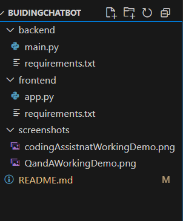
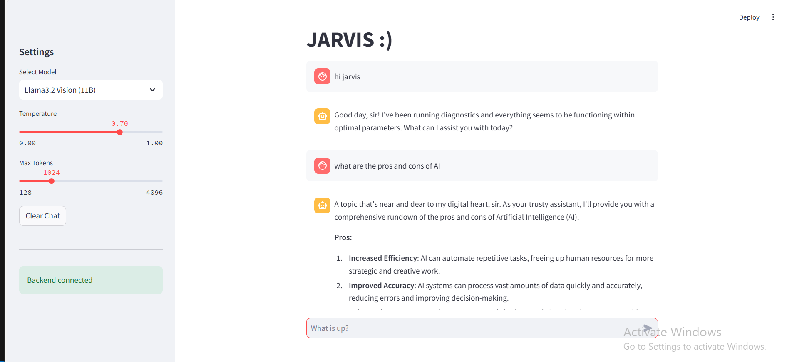
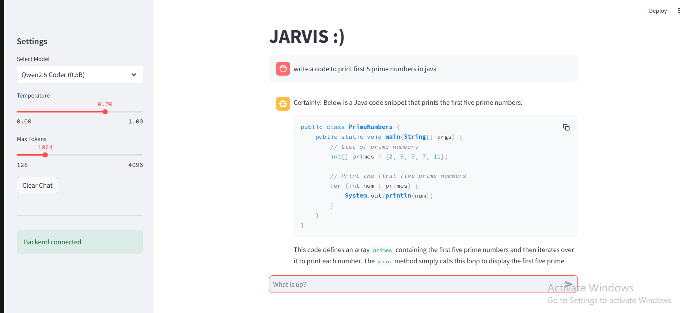

# 🤖 Long-session Personal Chatbot

This project is a **full-stack personal chatbot** that uses **FastAPI** as a backend and **Streamlit** as a frontend UI. The chatbot connects with local **LLM models through Ollama** and supports persistent multi-turn conversations.

---

## 📁 Project Structure



## 🚀 Features

- 🔄 **Chat with local LLM models** like `llama3.2-vision:11b` and `qwen2.5-coder:0.5b` via Ollama.
- ⚙️ Adjustable parameters like **temperature** and **max_tokens**
- 💬 Persistent multi-turn conversation with **chat history**
- 🌐 FastAPI-based backend with **CORS support**
- 🎨 Streamlit-based frontend with **model selector** and **status indicators**

---

## 🧑‍💻 How to Run the Project

> ⚠️ Make sure Python 3.9+ is installed and `ollama` is running on your system.

### ✅ Step-by-Step Setup

### 1. 🧠 Start the FastAPI Backend

Open a terminal and run:
```bash
cd backend
pip install -r requirements.txt
python main.py
✅ This will start FastAPI on: http://127.0.0.1:8000

You can verify:

API: http://127.0.0.1:8000/api/models
Health check: http://127.0.0.1:8000/health

2. 💬 Launch the Streamlit Frontend
Open a new terminal and run:
cd frontend
pip install -r requirements.txt
streamlit run app.py

✅ This will open the chatbot UI in your browser:
http://localhost:8501

🧰 Dependencies
📦 Backend (backend/requirements.txt)
fastapi>=0.68.0
uvicorn>=0.15.0
requests>=2.26.0
python-multipart>=0.0.5

📦 Frontend (frontend/requirements.txt)
streamlit>=1.28.0
requests>=2.26.0
```

### 📦 Models Used (via Ollama)
You can switch between the following local LLMs in the Streamlit UI:
llama3.2-vision:11b
qwen2.5-coder:0.5b

Make sure these are available and pulled in Ollama.

⚠️ Troubleshooting
❌ Ollama not running?
Run ollama serve in another terminal.

❌ Backend disconnected?
Check if FastAPI is running on port 8000.

❌ Connection timeout?
The model may take time. Increase timeout or check your system load.

## 🖼️ Screenshots

### 🏠 UI with Backend Integration





### 📃 License
This project is open-source for personal and learning purposes.

✨ Author
**Mounika Reddy Boggari**  
[GitHub](https://github.com/MounikaReddy666) | [LinkedIn](https://www.linkedin.com/in/mounika-reddy-boggari-a5851b296/)
📫 [Email me](mailto:boggarimounikareddy@gmail.com)


🙌 Contributions
Feel free to fork the repo, add features, and submit pull requests!